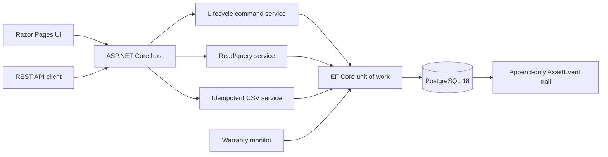
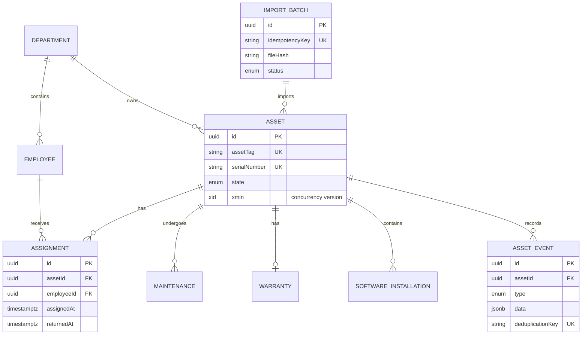
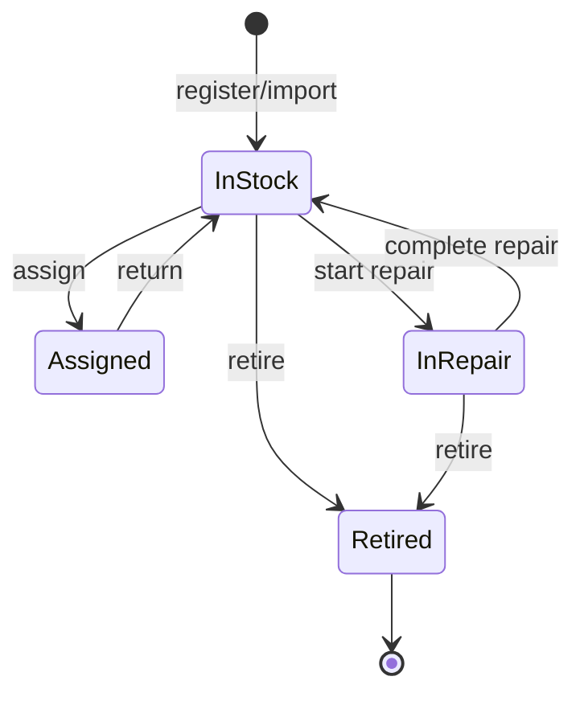

# Enterprise Asset Lifecycle

[](https://github.com/German4341374/enterprise-asset-lifecycle/actions/workflows/ci.yml)
[](LICENSE)
[](global.json)

`enterprise-asset-lifecycle` keeps the custody, repair, warranty, software, and retirement history of company equipment in one place. Its main engineering concerns are valid state transitions, transactional assignments, concurrent edits, traceable imports, and tests against a real PostgreSQL database.

The repository contains fictional demonstration records only. It does not require a cloud account or paid service.

## Features

- Register laptops, desktops, monitors, phones, peripherals, servers, and other assets.
- Assign equipment to an employee and return it in a serializable database transaction.
- Move in-stock equipment between departments.
- Start and complete repairs; retire equipment through a guarded state machine.
- Record warranty coverage and emit deduplicated expiring-warranty audit events.
- Record installed software and view historical owners.
- Import CSV files with an idempotency key and export spreadsheet-safe CSV.
- Filter and paginate assets, inspect dashboard metrics, and browse an append-only audit trail.
- Detect stale writes through PostgreSQL `xmin` optimistic concurrency.
- Return RFC 9457-style Problem Details with a stable error code and request trace ID.
- Publish a generated OpenAPI document at `/openapi/v1.json`.

## Architecture



The application is one deployable unit because asset state, custody, and audit history share a consistency boundary. Services separate command, query, import, and background-job responsibilities without introducing distributed-system failure modes.

### Data model



`IMPORT_BATCH` is an operational record rather than a direct foreign-key parent: the audit event stores the originating batch ID while asset records remain independent lifecycle aggregates.

## Technology stack

- .NET SDK 10.0.302 and ASP.NET Core runtime 10.0.10
- C# with nullable reference types and warnings treated as errors
- PostgreSQL 18.4
- Entity Framework Core 10.0.10 with Npgsql 10.0.3
- Razor Pages, Minimal APIs, built-in OpenAPI, and health checks
- xUnit and Testcontainers for PostgreSQL integration tests
- Docker Compose and GitHub Actions

Important NuGet dependencies and container image versions are pinned. Lock files make restores reproducible; Dependabot proposes controlled updates.

## Prerequisites

Choose one workflow:

- Docker Engine 27+ with Docker Compose v2; or
- .NET SDK matching [`global.json`](global.json) and PostgreSQL 18.

Windows users can run every command from WSL2 with Docker Desktop WSL integration enabled. GNU Make is optional because each target maps to a documented `dotnet` or `docker compose` command.

## Quick start with Docker

```bash
cp .env.example .env
# Replace POSTGRES_PASSWORD in .env with a long random local value.
docker compose up --build --detach
docker compose ps
curl --fail http://localhost:8080/health/ready
```

Open <http://localhost:8080>. The first startup applies EF Core migrations and inserts a small fictional seed when the database is empty.

Stop the environment without deleting data:

```bash
docker compose down
```

Delete the local demonstration database as well:

```bash
docker compose down --volumes
```

## Run with .NET

Start PostgreSQL, set the connection string through user secrets or an environment variable, then run the application:

```bash
dotnet tool restore
dotnet restore EnterpriseAssetLifecycle.slnx --locked-mode
export ConnectionStrings__Database='Host=localhost;Port=5432;Database=asset_lifecycle;Username=asset_app;Password=replace-me'
dotnet run --project src/EnterpriseAssetLifecycle.Web
```

Never put a real connection string in `appsettings*.json` or commit `.env`.

## REST API examples

List departments, then use a returned ID when creating an asset:

```bash
curl --fail http://localhost:8080/api/departments

curl --fail -X POST http://localhost:8080/api/assets \
  -H 'Content-Type: application/json' \
  -H 'X-Actor: portfolio-demo' \
  -d '{
    "assetTag": "AST-2001",
    "type": "Laptop",
    "manufacturer": "Example Systems",
    "model": "FieldBook 14",
    "serialNumber": "EXAMPLE-SN-2001",
    "departmentId": "10000000-0000-0000-0000-000000000001",
    "purchaseDate": "2026-06-01"
  }'
```

Every mutation response includes `version`. Supply that value as `expectedVersion` to prevent overwriting another operator's change:

```bash
curl --fail -X POST http://localhost:8080/api/assets/ASSET_ID/assign \
  -H 'Content-Type: application/json' \
  -d '{
    "employeeId": "20000000-0000-0000-0000-000000000001",
    "expectedReturnAt": "2026-09-01T12:00:00Z",
    "expectedVersion": 12345,
    "actor": "portfolio-demo"
  }'
```

A stale version returns HTTP `409` with code `CONCURRENCY_CONFLICT`. Reload the asset, reconsider the intended operation, and retry using the new version.

Key endpoints:

| Method | Path | Purpose |
|---|---|---|
| `GET`, `POST` | `/api/assets` | Search/register assets |
| `GET` | `/api/assets/{id}` | Current asset view and version |
| `POST` | `/api/assets/{id}/assign` | Transactional issue |
| `POST` | `/api/assets/{id}/return` | Transactional return |
| `POST` | `/api/assets/{id}/move` | Department transfer |
| `POST` | `/api/assets/{id}/repairs` | Start repair |
| `POST` | `/api/assets/{id}/repairs/complete` | Complete repair |
| `POST` | `/api/assets/{id}/retire` | Terminal transition |
| `PUT` | `/api/assets/{id}/warranty` | Create/update warranty |
| `POST` | `/api/assets/{id}/software` | Record software installation |
| `GET` | `/api/assets/{id}/events` | Append-only audit trail |
| `POST` | `/api/imports/assets` | Idempotent multipart CSV import |
| `GET` | `/api/assets/export.csv` | CSV export |
| `GET` | `/api/dashboard` | Operational totals |
| `GET` | `/health/live`, `/health/ready` | Process/database health |

## CSV import

The maximum file size is 5 MB. UTF-8 CSV uses this header:

```csv
assetTag,type,manufacturer,model,serialNumber,departmentCode,purchaseDate
AST-3001,Laptop,Example Systems,TravelBook,EXAMPLE-3001,OPS,2026-01-15
```

```bash
curl --fail -X POST http://localhost:8080/api/imports/assets \
  -H 'Idempotency-Key: intake-2026-08-02-a' \
  -H 'X-Actor: inventory-import' \
  -F 'file=@assets.csv;type=text/csv'
```

Reusing the key with identical bytes returns the original result. Reusing it with changed bytes returns `409 IDEMPOTENCY_CONFLICT`. Valid rows and their audit events commit atomically with the batch result; invalid rows are reported and skipped.

## State machine



An assigned asset must be returned before repair or retirement. A retired asset is terminal. See [state-machine.md](docs/state-machine.md) for command invariants.

## Verification

```bash
dotnet restore EnterpriseAssetLifecycle.slnx --locked-mode
dotnet format EnterpriseAssetLifecycle.slnx --verify-no-changes --no-restore
dotnet build EnterpriseAssetLifecycle.slnx --configuration Release --no-restore
dotnet test tests/EnterpriseAssetLifecycle.UnitTests --configuration Release
dotnet test tests/EnterpriseAssetLifecycle.IntegrationTests --configuration Release
docker compose build
```

The integration suite starts an isolated `postgres:18.4-alpine3.23` container, applies the real migration, and verifies lifecycle commands, stale writes, idempotent imports, the database audit trigger, export, and readiness. A running Docker daemon is mandatory.

## Security considerations

- The runtime container uses the non-root .NET application user and `no-new-privileges`.
- The application container has a read-only root filesystem; PostgreSQL is reachable only on the internal Compose network.
- EF Core parameterizes database operations. Request DTOs use server-side validation.
- CSV upload size is bounded, file bytes are hashed with SHA-256, and exported formula-like cells are prefixed to reduce spreadsheet injection risk.
- Problem Details hide unexpected exception details while exposing a trace ID.
- Audit events cannot be updated or deleted through EF Core or direct SQL because the migration installs a PostgreSQL trigger.
- No authentication or authorization is implemented. This is a local demonstration boundary, not an internet-ready identity model.

## Troubleshooting

- **Readiness is unhealthy:** run `docker compose logs database` and confirm the `.env` database values match the application connection string.
- **A mutation returns `CONCURRENCY_CONFLICT`:** reload the asset and retry only after reviewing the intervening audit events.
- **Import returns `IDEMPOTENCY_CONFLICT`:** create a new key for changed content; keep the old key only for an exact retry.
- **Testcontainers cannot connect:** start Docker and confirm `docker info` succeeds in the same WSL2 distribution.
- **Port 8080 is occupied:** set `APP_PORT=8081` in `.env` and recreate the Compose services.
- **Migration fails:** do not edit an applied migration. Restore the database backup, correct the forward migration, and redeploy.

## Design documentation

- [Architecture and consistency boundaries](docs/architecture.md)
- [Asset state machine](docs/state-machine.md)
- [Concurrency, import recovery, indexes, and retention](docs/operations.md)
- [Five-minute employer demonstration](DEMO.md)

## Known limitations

- Authentication, authorization, approval workflows, and per-department access controls are intentionally excluded.
- Warranty monitoring records an audit event; it does not send email or external notifications.
- The dashboard uses direct aggregate queries and has no reporting warehouse.
- CSV imports are bounded at 5 MB and commit in one EF Core transaction; very large enterprise imports should use chunked staging tables and resumable workers.
- Retention is documented but not automatically enforced.
- A future version could add barcode scanning, attachment storage, SSO, approval queues, OpenTelemetry traces, and point-in-time inventory reports.

## Design questions

- Why the asset and active assignment form one consistency boundary.
- How PostgreSQL `xmin` detects stale writes without a custom version column.
- Why serializable assignment transactions and a partial unique index are complementary defenses.
- How an idempotency key plus SHA-256 distinguishes a retry from changed input.
- Why audit immutability is enforced in both application code and the database.
- How Testcontainers tests the real PostgreSQL enum, partial index, trigger, migration, and concurrency behavior.

## License

MIT — see [LICENSE](LICENSE).
