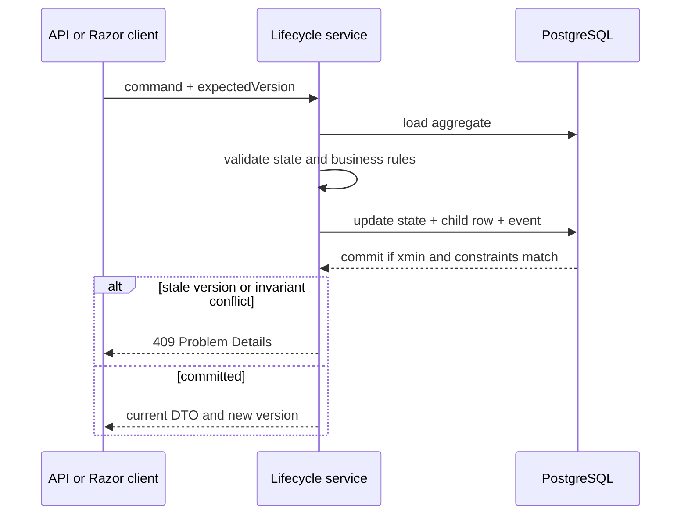

# Architecture and consistency boundaries

## Deployment shape

The system is a modular monolith: one ASP.NET Core process hosts Razor Pages, REST endpoints, lifecycle commands, read queries, CSV operations, and the warranty background service. PostgreSQL is the only durable dependency.

This shape keeps the portfolio project operationally small while preserving boundaries in code:

- `Domain` owns entities, state, and transition rules.
- `Services` owns use cases and transaction boundaries.
- `Infrastructure` owns EF Core, migrations, health checks, seeding, and HTTP error mapping.
- `Api` maps transport contracts to use cases.
- `Pages` provides a minimal operations UI and never changes entity state directly.

## Consistency boundaries

### Asset lifecycle aggregate

An `Asset` is the aggregate root for assignments, maintenance, warranty, software installations, and asset events. A lifecycle command loads one asset and its required children, checks the expected `xmin`, validates a state transition, appends an event, and saves once.

This prevents a visible state such as `Assigned` without an active `Assignment` row, or `InRepair` without an open `Maintenance` row.

### Assignment transaction

Issue and return commands run in a PostgreSQL `SERIALIZABLE` transaction. The issue command changes the asset state, moves custody to the employee's department, creates the assignment, and appends the event as one unit. A partial unique index on `Assignments.AssetId WHERE ReturnedAt IS NULL` is the final invariant against two active assignments.

Serializable isolation can abort one of two concurrent transactions. The caller receives a conflict, reloads state, and decides whether retrying is still correct. Blind automatic retries are inappropriate for a custody decision.

### CSV import batch

The file is capped at 5 MB and hashed before parsing. All valid assets, their `Imported` events, row counts, and the `ImportBatch` result are persisted by one EF Core `SaveChanges`, which uses a database transaction. Validation errors remain in the batch result; unexpected failures roll back the entire pending change set.

### Warranty scan

A scan creates only missing `WarrantyExpiring` events. The deduplication key is unique, so overlapping app instances converge on one event. The scan is eventually consistent with warranty edits and does not change the asset state.

## Request flow

## Trade-offs

- A modular monolith avoids messaging and distributed transactions, but one process owns both web traffic and the lightweight warranty loop.
- PostgreSQL-specific `xmin`, enum types, filtered indexes, and triggers improve correctness but intentionally reduce database portability.
- Direct dashboard aggregates are clear and current, but may need cached projections at much larger scale.
- The UI shares use-case services with the API, reducing duplicated rules but coupling both transports to the same deployment cadence.

